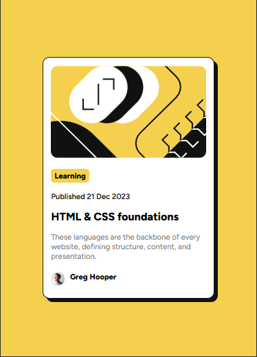
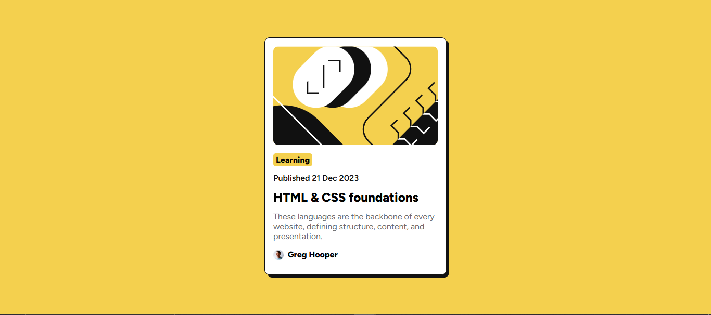
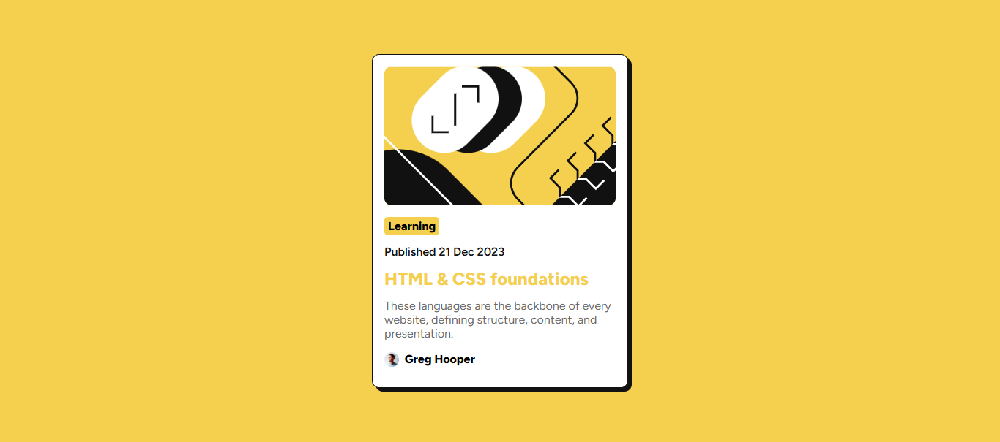

# Frontend Mentor - QR code component solution

This is a solution to the [Blog preview card challenge on Frontend Mentor](https://www.frontendmentor.io/challenges/blog-preview-card-ckPaj01IcS). Frontend Mentor challenges help you improve your coding skills by building realistic projects.

## Table of contents

- [Frontend Mentor - QR code component solution](#frontend-mentor---qr-code-component-solution)
  - [Table of contents](#table-of-contents)
  - [Overview](#overview)
    - [Screenshot](#screenshot)
      - [Mobile design](#mobile-design)
      - [Desktop design](#desktop-design)
      - [Active-state design](#active-state-design)
    - [Links](#links)
  - [My process](#my-process)
    - [Key Implementation Details](#key-implementation-details)
    - [Built with](#built-with)
    - [What I learned](#what-i-learned)
    - [Useful resources](#useful-resources)
  - [Author](#author)

## Overview

The Blog Preview Card is a responsive frontend mini-project built using HTML and CSS with a focus on Flexbox layout. It showcases a clean and modern card design that presents a blog post summary including an image, category tag, publish date, title, short description, and author profile. The goal is to mimic a modern UI card design commonly seen in web applications and landing pages.
The project focuses on:

- Semantic HTML structure for accessibility

- Flexbox for clean, responsive layout

- Basic styling to achieve a visually appealing card design

- A mobile-friendly design without the use of media queries.

### Screenshot

#### Mobile design



#### Desktop design

  

#### Active-state design



### Links

- Solution URL: [https://github.com/Randy-22/Blog-preview-card](https://github.com/Randy-22/Blog-preview-card)
- Live Site URL: [https://randy-22.github.io/Blog-preview-card/](https://randy-22.github.io/Blog-preview-card/)

## My process

This project was built using **semantic HTML5 and modern CSS3** to create a clean, responsive blog preview card component. All styles were applied through an **external CSS file** to maintain separation of structure and design.

The HTML consists of a main `.container` that uses Flexbox to center a single `.blog-card` component both vertically and horizontally on the page. The card displays a featured image, article tags, publishing date, heading, description, and author information—all structured for accessibility and clarity.

### Key Implementation Details

- Responsive Layout with clamp():
I used the `clamp()` CSS function to make the font size and card width responsive without relying on media queries. This allows the design to scale fluidly across screen sizes while respecting minimum and maximum limits.

- Flexbox Centering:
The `.container` uses Flexbox to center the `.blog-card` in the viewport, creating a balanced and professional layout across all devices.

- BEM Naming Convention:
Class names are structured following the **BEM (Block Element Modifier)** methodology. This improves code organization, prevents style conflicts, and enhances reusability for future components.

- Hover Interaction:
The `.blog-card__title` has a subtle hover effect, changing color and adding interactivity to the otherwise static design.

- Typography:
I used the Figtree font from Google Fonts for modern readability.

### Built with

- Semantic HTML5 markup
- CSS3 custom properties
- Flexbox
- Google Fonts

### What I learned

Key thing i have learnt with this project is the use of `clamp()` to create responsiveness.

The other thing i would like to point out is the use of the BEM Naming system to create class names.

To see how you can add code snippets, see below:

```HTML
<article class="blog-card">
  
  <p class="blog-card__title"></p>
</article>
```

```css
  width: clamp(250px, 80vw, 350px);
  padding: clamp(0.7rem, 2vw, 1rem);
```

### Useful resources

- [CSS flex-box Tricks](https://css-tricks.com/snippets/css/a-guide-to-flexbox/) - This site provides user friendly and a simple way to really grasp the concept of CSS flex box.
- [CSS clamp() Function](https://www.w3schools.com/cssref/func_clamp.php) - You can find out more on CSS clamp function on W3schools.

## Author

- github - [Randy Sekyere](https://github.com/Randy-22)
- Frontend Mentor - [@Randy-22](https://www.frontendmentor.io/profile/Randy-22)
